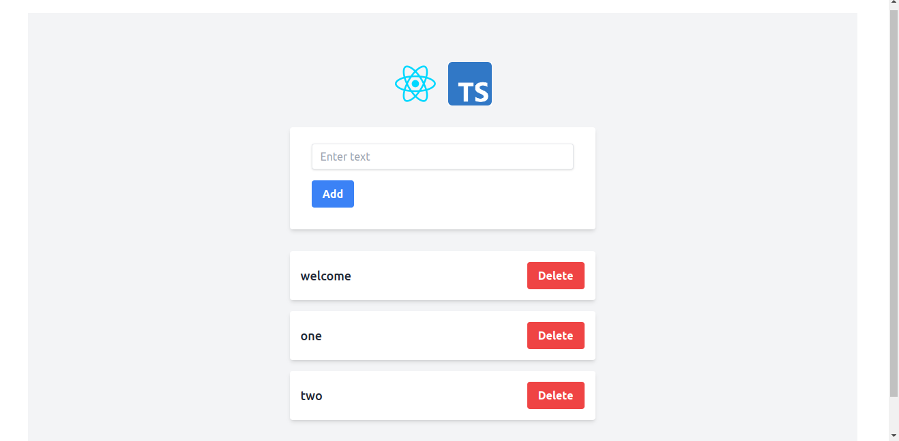

# To-Do App

This is a simple, feature-rich **To-Do List** application built using **React** with **TypeScript** and powered by **Vite** for fast development. The app allows users to add, display, and manage tasks interactively with a clean and minimal user interface.

## Features

- **Add Tasks**: Users can input and add tasks to a list.
- **Display Tasks**: All added tasks are displayed in a list format with their corresponding titles.
- **Delete Tasks**: Users can remove tasks from the list.
- **Form Validation**: Alerts users if they attempt to submit an empty task.

## Tech Stack

- **React**: For building interactive user interfaces.
- **TypeScript**: To provide type safety and catch errors during development.
- **Vite**: For a fast development environment with HMR (Hot Module Replacement).
- **Tailwind CSS**: For a responsive and easily customizable UI.

